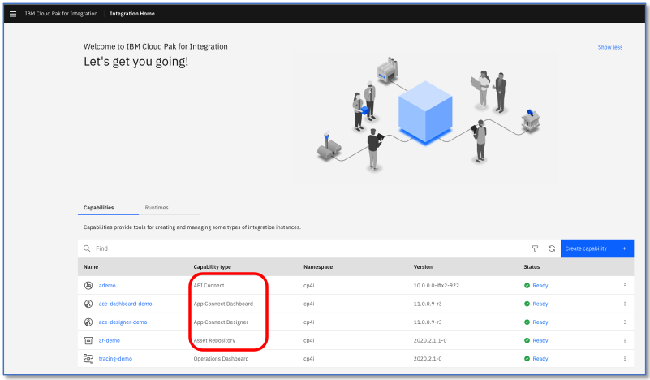
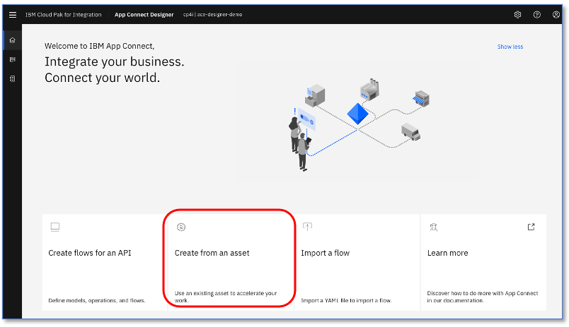
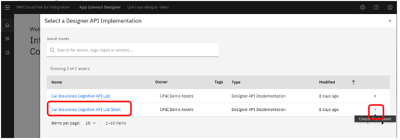

# Cognitive Car Insurance Claims Demo - Creating The Integration flow

We now have our connectors set up - it's time to build our integration flow!

Sign in to the Cloud Pak for Integration and open the Platform Navigator

We’re going to be using API Connect, App Connect and the Asset Repository for this demo.

## Capabilities, Instances and 'Demo Preparation'

If you've used the Demo Preparation setup, either through 1-click install, running the script or using the demo operator(Future) then it will already created the instances of the capabilities you need, so you don’t need to create new instances.

If you're not using the demo preparation, you can use or create your own instances: Details of what instances the Demo Preparation has provisioned are [here](../../Docs/DemoPreparationDetails/README.md)

IMPORTANT: Don’t worry if your installation has more capabilities than listed here e.g. MQ, Event Streams, Tracing etc. We are adding more capabilities on an ongoing basis so that we can give you more demos. Ignore the extras for the moment!

You can see that we have App Connect Designer (Tooling for building integrations), the App Connect Dashboard (this is what manages the integration runtimes) and API Connect (for managing APIs). You can also see the Asset Repository where we will store and share re-usable artefacts.

## Navigation

At any time, we can use the menu to navigate between these capabilities, as well as using the platform home screen. Use the ‘hamburger’ menu at the top left to access the menu and choose the capability you want like below:

## Accessing the Designer Integration Tooling
For either method, menu or instance view, click on ‘ace-designer-demo’ which is our instance of the designer tooling for this lab.

You’ll arrive at the App Connect Designer here:

This is where we can create all of our API integration flows and also manage our connectivity to our services and endpoints. You can create many integration flows and manage them all here.

At the moment, there’s nothing here yet, so let’s build some integration logic.

## Importing the Integration flow into designer
We’re going to import our flow from the Asset Repository: The 1-click install has put it there for you…

Click on ‘Create from an asset’ (you might have to wait a few seconds for this tile to appear)

We have a flow to use already stored in the Asset Repository: We’re going to import it to save you typing and clicking!

It also avoids a LOT of screenshots and ‘click here, click there, type this instructions’ – you could even probably work out how the flow works just from watching the video here: https://www.youtube.com/watch?v=TRzO26kawu4 but we’ll step you through it in this lab.

There is a lot of detailed designer flow documentation for when you want to delve deeper – a good place to start is the IBM App Connect Knowledge Center.

Click on the ‘+’ sign to the right on the ‘Car Insurance Cognitive API Lab Short’ asset and Create from the Asset (ensure you select the ‘Short’ version – the other one is for the extension scenario)

Integration flows are stored in the Asset Repository as .yaml source files – they look a lot prettier in the tooling though!

## Reviewing the Integration flow

This section can take some time. If you’re more interested as to how the flow is built, go through this section. If you may be short on time, as the flow is pre-built and we won’t change it in the lab,  you can skip straight to the [‘Starting the flow’](startingTheFlow.md) section and come back here later if you wish.  There are lots of screen shots, so you can read this demo flow walkthrough afterwards at your leisure.

Next Steps: click to [Reviewing the Integration Flow](reviewingTheIntegrationFlow.md)
