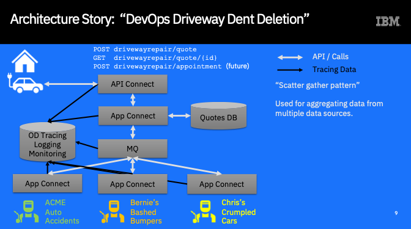

# Instructions to Run the Driveway Dent Deletion Demo
This set of instructions is a step-by-step guide to running the Driveway Dent Deletion demo.

You do not need to have expertise in using the Cloud Pak for Integration (CP4I), although previous experience will be useful.

Similarly for using the individual integration capabilities used in this demo: IBM App Connect, IBM MQ or IBM API Connect.

## A note on the instructions...
We appreciate that we have different audiences, ranging from 'I just want to get the demo running as fast as possible' to 'I want to use this as a learning exercise and explore all the details'

We've tried to keep the 'end-to-end flow' as simple as possible and provide lots of 'Deeper Dive / More Info / Why did we do this?' links off to the side.

## Demo Scenario
This demo shows how to use multiple capabilities of CP4I working together to provide a complete integration solution which is deployed using a fully automated CI/CD pipeline.

A full description of the demo scenario is [here](scenario.md)

## Key Demo Highlights
* Integration solution using multiple CP4I capabilities working together
* Fully containerised/Kubernetes deployment
* Deployed using CI/CD OpenShift pipeline
* Shows 'live' updating of integration versions without downtime
* Shows 'rollback' of deployments without downtime
* Shows HA resilience and scaling of the integration solution, recovering from failed pods, scaling of deployments etc.
* Shows end-to-end tracing capabilities

## List of Ingredients / Things you will need
If you already have these, skip right on! Otherwise expand the links to find out how to get them...

An Instance of IBM Cloud Pak for Integration (CP4I)

You'll need version 2020.2.1 or later.
  
You can run CP4I on the IBM cloud, on another cloud of your choice (e.g. AWS, Azure, GCP), on the Redhat Marketplace or on your own infrastructure.
  
If you need to get an instance of CP4I to run this demo, see [here](../../Docs/Environments/README.md)

A github account and repository

As we're going to be using piplelines for this demo, we'll be storing the artefacts that we want to deploy in github.  

The way that the demo works is that when you commit a change to github, this automatically starts the pipeline to build and deploy the change.  

As you need to make changes, you'll need to make a copy of our repository (know as 'forking') and then make changes to your copy/fork.

We'll give you instructions as to how to do this but you will need a github account. These are free to create (you can use a free email address if you wish and full instructions are at www.github.com)

If you already have a github account, you can use that.

## Structure of the demo
The demo is structured around a number of different scenarios or stories. These can be used in combination or stand-alone: it's your choice.

### Story 1: Deploy the Solution using a CI/CD pipeline
When integration components have been built and unit tested, we want to create container images for them and then deploy them all together using a deployment pipeline that deploys, configures and tests all of the components automatically without manual intervention.

Story 1 Instructions are [here](story1/README.md)

### Story 2: Deploy a new version of the integration with Zero Downtime. Also Rollback.
When we make changes to an integration e.g. from V1 to V2, we want to be able to deploy that integration with zero downtime and with minimal impact to consumers of the integration.

In addition, if we encounter issues with our new version, we want to easily be able to roll-back to the previous version.

Story 2 Instructions are [here](story2/README.md)

### Story 3: Apply a fixpack to or upgrade a version of the IBM software with zero downtime.
Similarly, when we want to apply an upgrade to the IBM software e.g. a fixpack or version upgrade, we want to be able to deploy that integration with zero downtime and with minimal impact to consumers of the integration.

In addition, if we encounter issues with our new version, we want to easily be able to roll-back to the previous version.

We also want to only be able to apply the fixpack to one integration at a time without impacting other integrations.

Story 3 Instructions are [here](story3/README.md)

### Story 4: Using CI/CD Piplines with Route to Live and multiple environments.
Being able to deploy integrations using pipelines is a good thing. Being able to take changes from DEV through to PROD automatically with a pipeline really increases the value.

If all of the tests pass at each deployment, it's possible to extend this out all the way to PROD.

This story shows deploying the solution to the DEV environment after which automated tests are run to make sure that the deployment is successful. If it is the solution is then deployed to a TEST environment and tested again.

This not only shows deploying a full pipeline across two environments but also shows how the integration components are bound together so that they call the correct instances of each other e.g. the DEV API Connect calls the DEV App Connect, TEST App Connect calls TEST MQ etc etc.

Story 4 Instructions are [here](story4/README.md)
