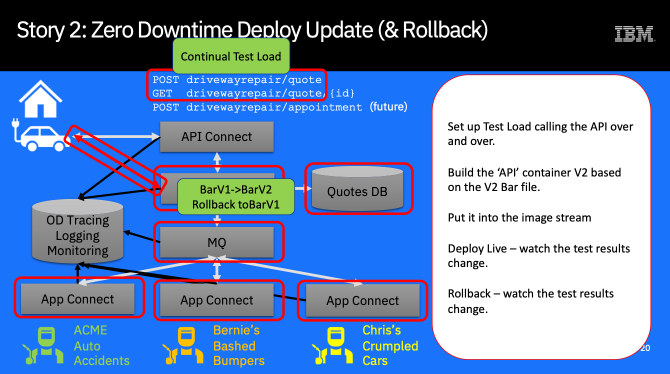

# Driveway Dent Deletion Demo
## Story 2: Show Automated Application Update (and Rollback) with a live system and zero downtime.

One of the advantages of using a containerised Kubernetes environment like CP4i is the ability to deploy application updates ‘live’ without downtime.

In addition, if there is an issue, we can roll-back the update to a previous state.

We are going to use the same pipeline as for Story 1: The difference is that the .bar (executable) file for the API App Connect flow will be different in V2 (it will return a different result from the API call so you can see it).

When we run the pipeline with the changed .bar file, it will create a new container image containing that .bar file and deploy it. As we will use a Kubernetes rolling update, the API will remain ‘live’ throughout the deployment and the new version will ‘roll over’ the previous one.

We will show this by using an automated test script which will keep a continuous load on the API so that you can see live service is maintained.

To roll back, we simply change the .bar file back to the previous version and re-run the pipeline – again, the rollback is ‘live’.

## Story Flow / List of Tasks
1. Ensure that the integration solution from [Story1](../story1/README.md) is deployed and running.
1. Create continuous load on the solution to simulate live users accessing it. Ensure you can see calls and responses running.
1. Update the version of one (or more) App Connect integrations to version2 (change to a V2 .bar file) and commit the change to git.
1. The change in git fires the webhook which starts the deployment Pipeline
1. Watch the pipeline build and deploy the new version of the integration.
1. During the deployment, keep watching the continuous test load: you will see the responses change from 'V1' to 'V2'. Note that there is no interruption of service.
1. When the new version is deployed (V2) we may want to roll back to version 1. Change the integrations in github back to V1 and commit.
1. The pipeline will run again and redeploy V1. Again, the continuous load will carry on running and you will see the version change.
